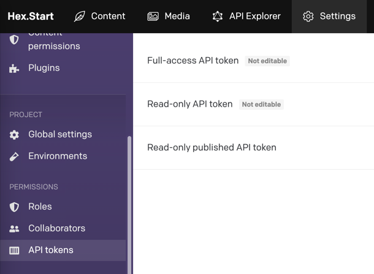

# Nuxt DatoCMS

[![npm version][npm-version-src]][npm-version-href]
[![npm downloads][npm-downloads-src]][npm-downloads-href]
[![License][license-src]][license-href]
[![Nuxt][nuxt-src]][nuxt-href]

Nuxt 3 module for [DatoCMS](https://datocms.com/), a wonderful Headless CMS.

- [✨ &nbsp;Release Notes](/CHANGELOG.md)
<!-- - [🏀 Online playground](https://stackblitz.com/github/hex-digital/nuxt-datocms?file=playground%2Fapp.vue) -->
<!-- - [📖 &nbsp;Documentation](https://example.com) -->

## Features

- ⛰ Integration with Nuxt's `useAsyncData()` for de-duplicated requests
- 🌲 Pre-configured preview mode for draft content, and real-time updates
- 👌 Auto-imports composables + components from [`vue-datocms`](https://github.com/datocms/vue-datocms)
- 🧭 Easily generate a sitemap for your DatoCMS-powered site (coming soon)
- ⚙️ Compatible with any data-fetching library (Villus, Apollo, axios, etc) (coming soon)

## Usage

_Note: This module is for Nuxt 3. We do not provide a Nuxt 2 version._

> If you are a first-time DatoCMS user, read the [Nuxt DatoCMS](https://www.datocms.com/cms/nuxtjs-cms) page 
> to get a project ready in less than 5 minutes.

### Installation

1. Add `@hexdigital/nuxt-datocms` dependency to your project

```bash
pnpm add -D @hexdigital/nuxt-datocms
# yarn add --dev @hexdigital/nuxt-datocms
# npm install --save-dev @hexdigital/nuxt-datocms
```

2. Add `@hexdigital/nuxt-datocms` to the `modules` section of `nuxt.config.ts`

```js
export default defineNuxtConfig({
  modules: [
    '@hexdigital/nuxt-datocms'
  ]
});
```

3. Configure the options for this module. If you want to enable viewing draft content, set the optional parameters too:

```js
export default defineNuxtConfig({
  modules: [
    '@hexdigital/nuxt-datocms'
  ],
  datocms: {
    publicReadOnlyToken: '<dato-cms-read-only-published-token>',

    // Optional - if you'd like to enable draft previews
    privateDraftEnabledToken: '<dato-cms-read-only-draft-enabled-token>',
    privatePreviewModePassword: 'showmethenewstuff', // A password required to enable draft previews
    privatePreviewModeEncryptionSecret: '14e6f2b5ebefb46270ed411e916c452a377c70f5d548cb6b672ec40d7e1ab8ef', // A hash that is stored on the User's device once draft is enabled, to prove it's legitimate. Change this to turn-off all currently active draft previews

    // Optional - if you'd like to allow user's to preview new content without needing to enter a password (beta documentation that's open for feedback, for example).
    disablePreviewPassword: true, // defaults to false

    // Optional - if you'd like to disable using the default server API routes for draft preview (so you can create your own, for example)
    registerApiHandlers: false, // defaults to true

    // Optional - do not include environment if you're not using environments, and usually no need to include endpoint either
    // environment: 'production', // defaults to undefined
    // endpoint: 'https://graphql.datocms.com',
  },
});
```

API tokens can be generated inside of your project, in Settings > API tokens. See image below



That's it! You can now use Nuxt DatoCMS in your Nuxt app ✨

### Requesting content

This module exposes two main composables, `useAsyncDatoCms()` and `useDatoCms()`.

For most cases, we recommend using `useAsyncDatoCms()`. It's a wrapper around Nuxt's `useAsyncData()`, which allows
us to de-duplicate our requests when using SSR, amongst other benefits.

```
// pages/index.vue

// This module sets `toHead` and `useAsyncDatoCms` to be auto-imported by Nuxt, if you have this enabled, so these imports aren't needed
import { toHead } from 'vue-datocms';
import { useAsyncDatoCms } from '@hexdigital/nuxt-datocms';

import { homepageQuery } from '~/apis/dato-cms/graphql/queries/getHomepage';

const { data } = await useAsyncDatoCms({ query: homepageQuery });

// An example of using page data to set your SEO tags for the page
useHead(() => toHead(data.value?.homepage?._seoMetaTags || {}));
```

If you're not looking to use `useAsyncData()` at all, then you can use the `useDatoCms()` composable instead. The
behaviour is the same, just without the `useAsyncData()` wrapper around the fetch call.

## Module Development

```bash
# Install dependencies
npm install

# Generate type stubs
npm run dev:prepare

# Develop with the playground
npm run dev

# Build the playground
npm run dev:build

# Run ESLint
npm run lint

# Run Vitest
npm run test
npm run test:watch

# Release new version
npm run release
```

## Contributing

All contributions are welcome. Please see our [Contribution Guidelines](./CONTRIBUTING.md).

<!-- Badges -->
[npm-version-src]: https://img.shields.io/npm/v/@hexdigital/nuxt-datocms/latest.svg?style=flat&colorA=18181B&colorB=28CF8D
[npm-version-href]: https://npmjs.com/package/@hexdigital/nuxt-datocms

[npm-downloads-src]: https://img.shields.io/npm/dm/@hexdigital/nuxt-datocms.svg?style=flat&colorA=18181B&colorB=28CF8D
[npm-downloads-href]: https://npmjs.com/package/@hexdigital/nuxt-datocms

[license-src]: https://img.shields.io/npm/l/@hexdigital/nuxt-datocms.svg?style=flat&colorA=18181B&colorB=28CF8D
[license-href]: https://npmjs.com/package/@hexdigital/nuxt-datocms

[nuxt-src]: https://img.shields.io/badge/Nuxt-18181B?logo=nuxt.js
[nuxt-href]: https://nuxt.com
